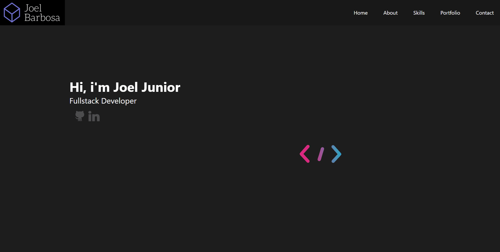

# Sextou V1 💼

## Rodando o projeto

> Baixe ou clone este repositório.

> Acesse a raiz do projeto por um console e execute:

- `yarn add ou npm i` para instalar as dependências do projeto
- `yarn start ou npm start` para rodar a aplicação

## Imagens: 📷

### <strong>Home:</strong>

## Sobre o projeto: 📃

Este é o meu portfólio, criado com React.js.

## Requisitos do projeto: ✅
* Home - Página com uma saudação e uma animação ao lado.
* About - Página com um resumo sobre mim.

## Frameworks e Tecnologias Utilizadas: 🌌
### Front-End: 🎨

* <strong>React.js</strong> (Criação da Interface)
* <strong>CSS</strong> (Estilização)
* <strong>Lottie</strong> (Exibir animações feitas no After Efects)
* <strong>React Transition Group</strong> (Animações entre as transições das páginas)
